# Manual do Quota

Guia de utilização da aplicação para quem gere ligas. Não é preciso saber nada
de informática para seguir este manual.

Se só treinas uma equipa e queres ver a tua liga e as tuas dívidas, sem te
perderes nas partes de gestão, o guia mais direto é o
[MANUAL_TREINADOR.md](MANUAL_TREINADOR.md).

Para documentação técnica, ver [DESENVOLVIMENTO.md](DESENVOLVIMENTO.md) e
[API.md](API.md).

---

## 1. O que é o Quota

O Quota gere ligas amadoras: as equipas, as jornadas, a classificação e o
dinheiro que cada equipa deve à liga.

A ideia central é simples. Cada jornada dá uma classificação, e quem fica pior
classificado paga mais. A aplicação faz essas contas sozinha e mostra-te, a
qualquer momento, quanto já entrou no pote e quanto ainda falta receber.

### Os dois tipos de conta

**Gestor.** Cria a liga, inscreve as equipas, abre e fecha jornadas, define
quanto se paga e marca os pagamentos que recebeu. Vê apenas as suas próprias
ligas.

**Treinador.** Vê as ligas onde treina alguma equipa e o que a sua equipa deve.
Não altera nada. Um treinador só precisa de conta se quiser ver isto sozinho.
Se não tiver email, ou simplesmente não quiser conta, continua tudo a funcionar
com o gestor a tratar dele.

**A mesma pessoa pode ser as duas coisas com um só login.** Se geres uma liga e
ao mesmo tempo treinas uma equipa (na tua liga ou na de outra pessoa), não
precisas de duas contas. Ver a secção 2.3.

---

## 2. Entrar na aplicação

Não há registo aberto. Toda a gente entra por convite. Isto é de propósito:
evita que apareçam contas que ninguém sabe de onde vieram.

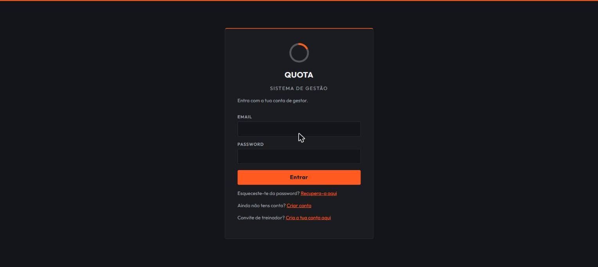

### 2.1 Criar conta de gestor

Precisas de um código de convite dado por um administrador.

1. Abre a aplicação e carrega em **Criar conta**.
2. Preenche o código do convite, o nome, o email e uma password com pelo menos
   10 caracteres.
3. Carrega em **Criar conta**. Ficas logo com sessão aberta.

Cada código serve uma vez só. Se te enganares a escrever, pede outro.

### 2.2 Criar conta de treinador

O convite de treinador é dado pelo gestor da liga onde treinas, não por um
administrador, e é sempre para uma equipa em concreto: "treinas o Bairro FC, na
Liga do Café".

1. **Abre o link** que o gestor te enviou. A página diz-te quem te convidou e
   para que equipa.
2. Preenche o nome, o email e a password.

Não tens de escrever código nenhum: ele vai dentro do link. Se o link já não
funcionar, o convite expirou ou foi revogado — pede outro ao gestor.

Uma conta criada assim **não pode criar ligas próprias**. Se precisares disso,
um administrador tem de te dar essa permissão.

### 2.3 Já tens conta e recebeste um convite de treinador

Não crias uma segunda conta. Abre o link do convite já com sessão iniciada: a
página oferece **Aceitar com a minha conta** e a equipa passa a aparecer na que
já tens. Se ainda não tinhas sessão, entra primeiro e volta a abrir o link.

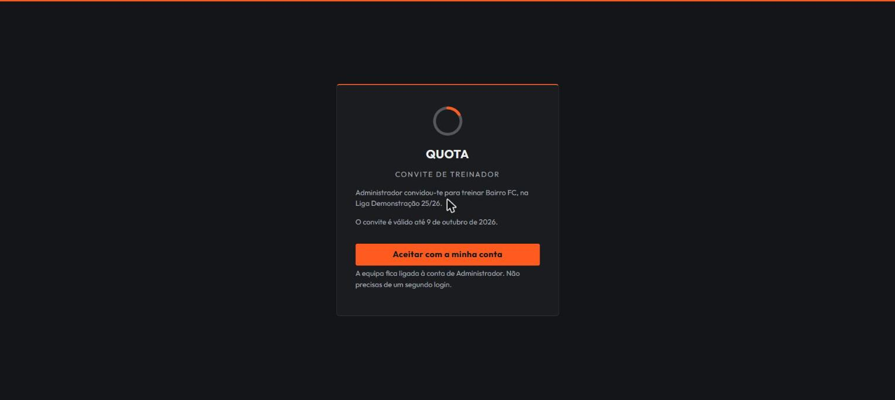

A partir daí, a mesma conta gere as tuas ligas e mostra as equipas que treinas.

(O caminho antigo continua a existir: em **Password**, na secção **Ligar convite
de treinador**, colando o código à mão.)

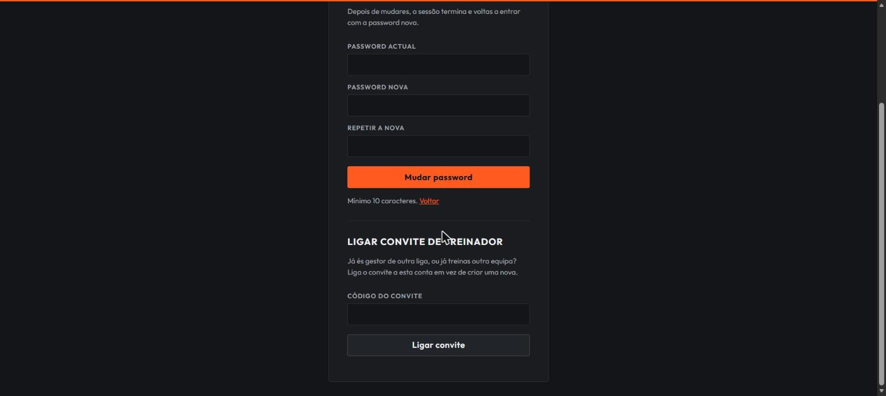

### 2.4 Mudar a password

Em **Password**. Tens de saber a password actual. Depois de mudares, a sessão
termina e voltas a entrar com a nova, em todos os sítios onde estavas.

### 2.5 Se te esqueceste da password

Na página de entrada, carrega em **Recupera-a aqui**. Escreves o email da conta
e recebes uma mensagem com um link.

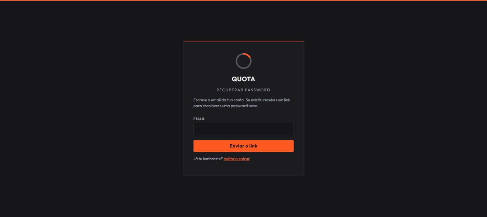

O link serve **uma vez** e **expira ao fim de uma hora**. Se demorares, ou se o
usares e precisares de outro, é só pedir de novo.

Alguns pormenores que valem a pena saber:

- A página diz sempre a mesma coisa, quer o email tenha conta quer não. É de
  propósito: assim ninguém pode usar este ecrã para descobrir quem está
  registado na aplicação.
- Se não receber nada, confirma a pasta de spam e confirma que escreveste o
  email com que te registaste, e não outro qualquer.
- Ao redefinires a password, **todas as sessões dessa conta são terminadas**,
  incluindo as de outros telemóveis ou computadores. Se estás a recuperar
  precisamente porque desconfias que alguém entrou na tua conta, é isto que
  põe essa pessoa fora.

> **Se o email da tua conta estiver mal escrito**, a mensagem nunca chega, e
> nesse caso só um administrador pode corrigir o email (secção 9.2).

---

## 3. Criar e gerir uma liga

### 3.1 Criar

Na coluna da esquerda, escreve o nome e o número máximo de equipas (entre 1 e
45) e carrega em **Criar liga**.

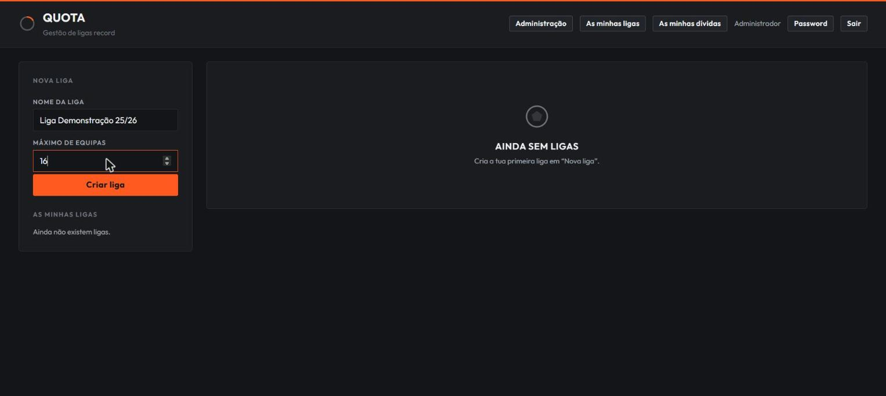

### 3.2 O cabeçalho da liga

Depois de escolheres uma liga, o cabeçalho mostra o nome, o logo e um conjunto
de etiquetas: se está activa, quantas equipas tem, quantas estão activas e
quantas jornadas já existem.

Podes pôr o **logo** da liga carregando no quadrado à esquerda do nome. Aceita
PNG, JPEG e WEBP até 1 MB. Para o tirar, usa o × que aparece no canto.

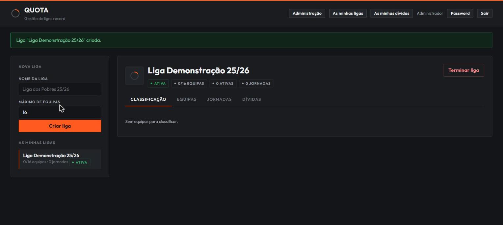

### 3.3 Terminar uma liga

O botão **Terminar liga** fecha-a definitivamente. Depois disso não se
acrescentam equipas nem se abrem jornadas, e o logo também deixa de poder ser
alterado. A liga continua visível, com tudo o que lá está.

Não há forma de voltar atrás.

---

## 4. Equipas

No separador **Equipas**.

### 4.1 Inscrever

Escreve o nome da equipa, o nome do treinador e — se souberes — o **email do
treinador**, e carrega em **Adicionar equipa**. O email é opcional e serve para
uma coisa só: o convite ir sozinho para lá em vez de teres de o entregar à mão.
Podes acrescentá-lo ou corrigi-lo depois, em **Editar**.

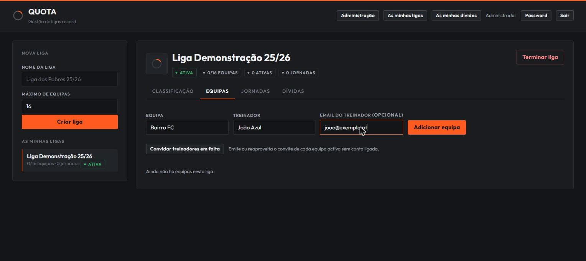

Duas coisas acontecem ao mesmo tempo:

- Se a liga tiver uma regra de dívida com valor de inscrição, esse valor é
  cobrado à equipa nesse momento.
- Não podes ter duas equipas com o mesmo nome na mesma liga. Se tentares, a
  aplicação recusa. Nomes repetidos tornavam a classificação impossível de ler.

### 4.2 Convidar o treinador

A coluna **Conta** diz-te em que pé está cada equipa:

| O que lá está | O que quer dizer |
| --- | --- |
| Sem convite | ninguém foi convidado ainda |
| Convite pendente | há um convite por usar (passa o rato por cima para veres até quando) |
| Ligada | o treinador já tem conta e vê a equipa |

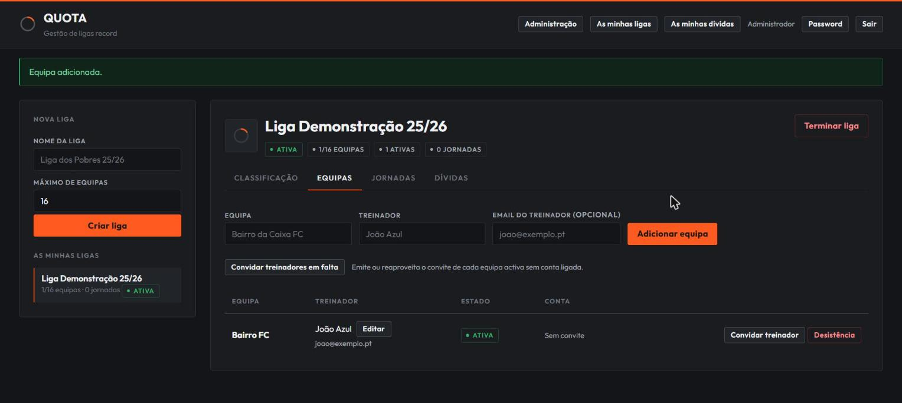

O botão **Convidar treinador** cria o convite e:

- **se o treinador tiver email**, envia-lho — a mensagem diz quem o convidou e
  para que equipa, e leva o link;
- **copia o link** para a área de transferência, sempre, tenha o email saído ou
  não. É a rede de segurança: podes envia-lo por WhatsApp ou como quiseres.

A mensagem que aparece em cima diz-te exactamente o que aconteceu — enviado,
sem email, ou não foi possível enviar. O treinador abre o link e cria conta
(secção 2.2) ou liga-o à que já tem (secção 2.3).

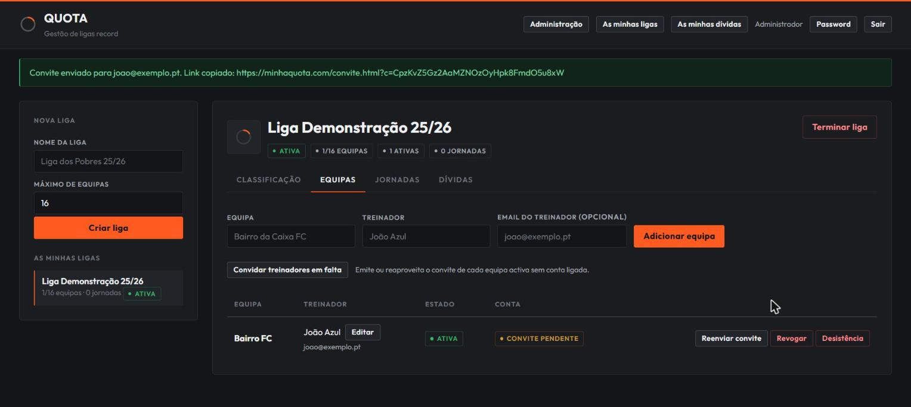

O email que o treinador recebe é direto: quem convidou, para que equipa e liga, e um botão para aceitar.

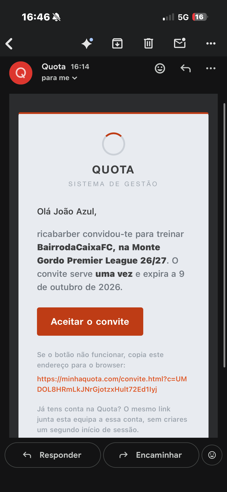

Com email, o botão passa a **Reenviar convite**: dá o mesmo convite outra vez.
Cada convite é enviado no máximo **três vezes**, e não duas seguidas — é para
ninguém encher a caixa de correio de outra pessoa. Chegado o limite, o link
continua a ser copiado e entregas-lo tu.

Carregar outra vez no mesmo botão — agora **Copiar link** — dá-te o mesmo link,
não um segundo convite. Isso é de propósito: dois convites válidos para a mesma
equipa eram duas chaves da mesma porta, e a primeira ficava por aí sem ninguém
saber onde.

**Os convites duram 30 dias.** Passado esse prazo o link deixa de funcionar e
basta convidar outra vez.

**Revogar** invalida o link que já deste — usa-o se o mandaste para o sítio
errado. A seguir podes emitir um novo.

**Editar**, ao lado do nome do treinador, corrige o nome que escreveste ao
inscrever a equipa. É o nome que a liga mostra, mesmo depois de o treinador ter
conta: o nome da conta é dele, este é o teu rótulo.

**Desligar conta** corta o acesso de quem lá estava — para quando um treinador
sai da equipa. A dívida da equipa não vai atrás: é da equipa, não de quem a
treina. Depois disso podes convidar o treinador novo.

### 4.3 Convidar os que faltam, de uma vez

O botão **Convidar treinadores em falta**, por cima da tabela, trata da liga
toda: emite o convite de cada equipa activa cujo treinador ainda não tenha
conta, envia-o a quem tiver email, e mostra-te o resultado equipa a equipa.

**Copiar os links** dá-te uma linha por equipa, pronta a colar no grupo:

```
Bairro FC (João Azul): https://.../convite.html?c=...
```

Só aparecem as equipas que ficaram com convite — quem já tem conta não leva link
nenhum. Podes carregar outra vez daqui a uns dias: quem ainda não aceitou
mantém o mesmo link, e serve de lembrete. Equipas que desistiram ficam de fora;
se precisares mesmo, convida-as uma a uma pela linha delas.

### 4.4 Desistência

O botão **Desistência** marca a equipa como desistente. Ela deixa de contar
para as jornadas seguintes e aparece riscada na classificação.

**O que ela já devia continua a dever.** A dívida de uma equipa desistente
continua a contar no pote da liga. Isso é de propósito: o dinheiro continua a
fazer falta.

---

## 5. Jornadas

No separador **Jornadas**.

### 5.1 Treino e oficial

As primeiras cinco jornadas são de **treino**, e as seguintes são **oficiais**.
Cada tipo tem a sua própria numeração, por isso vais ver uma "Jornada 1" de
treino e, mais tarde, uma "Jornada 1" oficial. É normal.

Por omissão, para efeitos de dinheiro e de classificação, as duas contam igual.
Há ligas em que não: em **Dívidas** podes desligar as duas coisas — que as
jornadas de treino sejam cobradas, e que os pontos delas contem para a
classificação. Nessas ligas o treino é um aquecimento e a tabela só começa a
contar quando as oficiais arrancam.

### 5.2 O ciclo de uma jornada

**Só pode haver uma jornada por fechar de cada vez.** Enquanto não fechares a
que está aberta, não abres a seguinte.

1. **Abrir jornada.**
2. **Inserir as pontuações** de cada equipa activa e carregar em **Guardar** em
   cada linha.
3. **Fechar jornada.** As posições são atribuídas por ordem decrescente de
   pontuação.

Enquanto a jornada está aberta, a tabela mostra-te uma previsão: como ficaria a
classificação e quanto pagaria cada equipa se fechasses agora.

### 5.3 Empates

Se, ao fechar, ficarem equipas com a mesma pontuação, **a jornada não fecha**.
Fica em estado *Desempate*, a amarelo, e aparece um painel por baixo da tabela.

Nesse painel, as equipas empatadas aparecem agrupadas por pontuação. Usa as
setas ↑ e ↓ para as ordenares, da melhor para a pior, e carrega em **Confirmar
desempate**. Só então a jornada fecha.

Isto não é uma chatice desnecessária: a posição decide quanto cada equipa paga.
Se duas equipas ficassem empatadas em quinto, ambas pagariam o valor do quinto
lugar e a liga perdia a diferença para o sexto.

Enquanto o empate não estiver resolvido:

- as pontuações ficam trancadas,
- não se abre a jornada seguinte,
- **não é cobrado nada**.

> **Atenção:** depois de uma jornada fechar, as pontuações não se alteram. Se
> te enganaste numa pontuação, confirma antes de fechar. Não existe forma de
> reabrir uma jornada.

### 5.4 A coluna "Valor"

Mostra quanto aquela jornada em concreto pesa para cada equipa, segundo a regra
da liga. Não é o total da equipa: quando o bloco fechar, este valor soma-se ao
das outras jornadas do mesmo bloco.

### 5.5 Reabrir uma jornada

O botão **Reabrir jornada** aparece só na última jornada fechada da liga, e só
enquanto o dinheiro dela ainda não tiver saído (nenhum bloco de dívida nem
cobrança de época já fechado por causa dela). É para corrigir um engano logo a
seguir a fechar — não uma forma geral de voltar atrás.

Ao reabrir, a jornada volta a aceitar pontuações, e as posições são
recalculadas quando voltares a fechá-la.

Se a jornada já tiver dinheiro associado, ou não for a última, o botão nem
aparece — não há forma de reabrir por baixo de jornadas mais recentes.

---

## 6. Classificação

No separador **Classificação**. Soma os pontos de todas as jornadas e ordena as
equipas. O primeiro lugar aparece destacado, e as equipas desistentes ficam no
fim, riscadas.

Se duas equipas tiverem os mesmos pontos no total da época, a tabela ordena-as
por nome — até decidires um critério diferente.

### 6.1 Desempate

Quando há equipas empatadas, aparece um painel **Desempate** por baixo da
tabela, com as equipas empatadas agrupadas por pontuação. Usa as setas ↑ e ↓
para as ordenares e carrega em **Confirmar desempate**.

Ao contrário do desempate de uma jornada (secção 5.3), este não bloqueia nada:
a classificação geral não decide dinheiro, só decide a ordem que se vê. Por
isso não precisas de resolver o empate para continuar a usar a liga.

**O critério fica a valer sempre que aquelas equipas voltarem a empatar nos
mesmos pontos** — não é só para agora. Se depois uma delas ganhar ou perder
pontos e vier a empatar de novo, mas com outra equipa ou noutro total, tens de
ordenar outra vez: o critério antigo só se aplica ao empate exacto para que foi
definido.

---

## 7. O dinheiro

No separador **Dívidas**.

### 7.1 A regra da liga

É aqui que dizes como a tua liga cobra. Enquanto não definires uma regra, a
aplicação não cobra nada sozinha e tu lanças tudo à mão.

A primeira escolha é **de onde sai o valor de cada posição**: por fórmula ou por
tabela.

| Campo | O que significa |
|---|---|
| **Inscrição** | Valor cobrado uma vez, quando a equipa entra na liga. |
| **Valor inicial** | O que paga quem fica no melhor escalão. |
| **Incremento** | Quanto sobe de escalão para escalão. |
| **Equipas por escalão** | Quantas posições cabem em cada escalão. |
| **Valor máximo** | Tecto: nenhuma equipa paga mais do que isto por jornada. |
| **Jornadas por bloco** | De quantas em quantas jornadas se fecha uma conta. |

**Exemplo.** Valor inicial 0,00, incremento 0,50 e 5 equipas por escalão:

- 1º ao 5º lugar: 0,00 €
- 6º ao 10º: 0,50 €
- 11º ao 15º: 1,00 €

e assim por diante, até ao valor máximo.

> Se puseres 5 equipas por escalão, as cinco primeiras pagam todas o mesmo. Não
> é um erro. Se quiseres que cada posição pague um valor diferente, põe 1 equipa
> por escalão.

#### Por tabela, quando a fórmula não chega

Nem todas as ligas sobem sempre o mesmo de posição para posição. Se a tua sobe
0,20€ por lugar até ao 7º e 0,10€ daí em diante, não há fórmula que diga aquilo
— escolhe **Por tabela** e escreve os valores:

```
1-0€
2-0,10€
3-0,30€
...
21-2,50€
```

Uma linha por posição, do 1º ao último, **sem saltos**. Podes colar a lista tal
como a tens escrita: vírgula ou ponto, com ou sem €, tanto faz. Se faltar uma
posição a aplicação diz-te qual, em vez de adivinhar.

Se entrar uma equipa a mais do que as linhas que escreveste, quem ficar para lá
do fim paga o valor da última linha.

#### As jornadas de treino

Duas opções, no fundo do mesmo formulário:

- **Cobrar também as jornadas de treino.** Ligado, é o que a aplicação sempre
  fez. Desligado, as cinco primeiras jornadas não geram dívida nenhuma.
- **Os pontos das jornadas de treino contam para a classificação.** Desligado, a
  tabela recomeça do zero quando as oficiais arrancam.

São independentes, e valem só para esta liga.

#### Cobranças de época (Inverno, Verão)

Algumas ligas têm, por cima do que se paga em cada jornada, uma cobrança a meio
da época e outra no fim: cada equipa paga conforme o **lugar em que está na
classificação geral** naquele momento.

Em **Cobranças de época** dás-lhe um nome, a **jornada oficial** em que cai e a
sua própria tabela — que não é a das jornadas: pode ir de 0€ a 10€ enquanto a
semanal vai de 0€ a 2,50€.

> A jornada é a **oficial**, não a contagem desde o início. Se a tua prova tem
> 34 jornadas e as cinco primeiras são de treino, o meio da época (a 17ª) é a
> **12ª oficial**, e o fim (a 34ª) é a **29ª oficial**.

Quando essa jornada fecha, cada equipa leva um bloco com o nome à frente — na
lista de dívidas lês "Inverno", não "Bloco 12".

**Se houver empate**, a cobrança fica à espera. Duas equipas com os mesmos
pontos ficariam em lugares diferentes por ordem alfabética, e isso aqui é
dinheiro: a app mostra-te as equipas empatadas e ordena-las tu, como já fazes
nas jornadas. Só depois é que cobra. Se as posições empatadas pagarem o mesmo,
não te pergunta nada.

Uma cobrança **já feita** não se apaga nem muda de jornada: o dinheiro está
lançado.

Podes alterar a regra a meio da época. As jornadas já cobradas não são
recalculadas: a alteração vale daí para a frente. Isso inclui as opções do
treino: se ligares a cobrança do treino a meio, as jornadas de treino que ainda
não tinham sido cobradas entram no bloco seguinte.

### 7.2 Blocos

Um **bloco** é uma conta fechada. Há dois tipos:

- **Inscrição:** a entrada na liga, cobrada uma vez.
- **Período:** o conjunto de jornadas definido em "jornadas por bloco".

Quando fecham jornadas suficientes, a aplicação fecha o bloco sozinha e cobra a
cada equipa **a soma do que ela deveu em cada uma dessas jornadas**. Uma equipa
que correu mal em duas jornadas do bloco paga as duas.

Se a liga não tiver regra definida, usa o campo **Novo bloco (valor)** para
lançares um valor à mão.

Um bloco de 0,00 € aparece já como pago. Não há nada para receber, por isso a
aplicação não te chateia com isso.

### 7.3 Marcar pagamentos

Escolhe a equipa na lista à esquerda e depois:

- **Marcar pago** numa linha, para um bloco de cada vez.
- **Marcar tudo pago**, para liquidar tudo o que aquela equipa deve.

> **Atenção:** "pago" quer dizer que **tu** confirmaste que recebeste. A
> aplicação não movimenta dinheiro nenhum nem se liga a bancos ou a MB Way. É um
> registo, não um sistema de pagamentos.

### 7.4 O pote da liga

No cabeçalho da liga, por baixo das etiquetas, aparecem três números:

- **Total:** tudo o que já foi lançado nesta liga.
- **Pago:** o que já deste por recebido.
- **Dívidas:** o que falta receber.

Total é sempre igual a Pago mais Dívidas. Inclui as inscrições, os blocos de
período, e o que as equipas desistentes deixaram por pagar.

Se a liga ainda não cobrou nada, o mostrador não aparece.

---

## 8. Se treinas uma equipa

Duas páginas no topo da aplicação:

**As minhas ligas.** A classificação e as jornadas das ligas onde treinas.
Só de leitura, não alteras nada. Vês também o pote da liga, que é um valor do
conjunto e não diz quanto cada equipa deve.

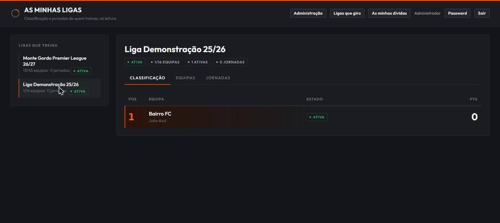

**As minhas dívidas.** O que cada equipa que treinas ainda deve, em todas as
ligas, com o detalhe bloco a bloco e um total geral no topo.

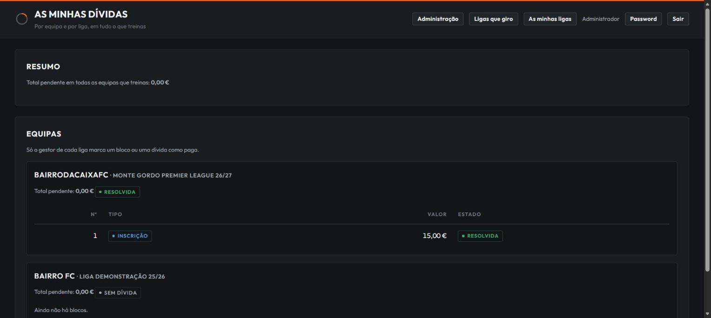

Quem marca os pagamentos é sempre o gestor da liga.

---

## 9. Administração

Só para contas de administrador, no botão **Administração**.

### 9.1 Convites de gestor

Cria códigos para novas contas de gestor. Podes deixar uma nota (para te
lembrares a quem o deste) e um prazo de validade em dias. O código só é
visível enquanto não for usado: copia-o e entrega-o.

**Revogar** invalida um convite que ainda não tenha sido usado.

### 9.2 Contas

A tabela lista todas as contas. Em cada linha podes:

- **Tornar admin** ou **Despromover**.
- **Desativar** ou **Reativar**. Uma conta desactivada perde o acesso de
  imediato, mesmo que a pessoa esteja com a sessão aberta. As ligas dela não são
  apagadas.
- **Bloquear** ou **Permitir criar ligas**. Serve para contas que entraram por
  convite de treinador e que queiras promover, ou o contrário.
- **Corrigir email**. Existe para desenrascar quem escreveu o email mal no
  registo: sem isto essa conta não recebe o link de recuperação e fica presa,
  porque só o próprio muda o email e o próprio já não consegue entrar. Ao
  corrigires, as sessões dessa conta terminam.

Não podes alterar a tua própria conta. É deliberado, para ninguém se fechar
fora da aplicação por engano.

> **Nota sobre contas antigas:** contas criadas antes de a permissão "cria
> ligas" existir ficaram todas com ela ligada, incluindo contas de treinador.
> Vale a pena olhar para essa coluna uma vez e corrigir o que não fizer sentido.

---

## 10. O que a aplicação não faz

Para não haver surpresas:

- **Não movimenta dinheiro.** Marcar como pago é um registo do que recebeste.
- **Não confirma o email no registo.** O registo é por convite, e ninguém se
  regista sem um. Mas também ninguém verifica se o email que escreveste está
  certo, e só dás por isso quando precisares de recuperar a password.
- **Não reabre jornadas antigas.** Só a última, e só antes de qualquer
  dinheiro sair dela (secção 5.5). As anteriores são definitivas.
- **Não desfaz uma liga terminada.**
- **Não apaga equipas.** Quem sai marca-se como desistente, e o histórico fica.

---

## 11. Problemas comuns

**"Já existe uma equipa com este nome nesta liga."**
Escolhe outro nome. Duas equipas com o mesmo nome tornavam as tabelas
impossíveis de ler.

**"Já existe uma jornada aberta nesta liga."**
Fecha a que está aberta primeiro. Se ela estiver em desempate, resolve o
empate.

**"Esta jornada está à espera de desempate."**
Vai ao separador Jornadas, escolhe essa jornada e ordena as equipas empatadas.

**"Não tens permissão para esta operação."**
A tua conta não pode criar ligas. Pede a um administrador.

**"A tua conta foi desativada."**
Fala com um administrador.

**"Demasiadas tentativas com este email. Espera uns minutos e tenta outra vez."**
Depois de 5 tentativas erradas com o mesmo email, a aplicação bloqueia esse
email durante 15 minutos — mesmo que a próxima tentativa fosse a password
certa. É uma proteção contra quem tenta adivinhar passwords, não um erro. Se
não foste tu, é sinal de que alguém tentou entrar na tua conta: espera os 15
minutos e considera mudar a password (secção 2.4).

**"A password desta conta foi alterada. Entra outra vez."**
A password foi mudada noutro sítio, ou recuperada por email, e as sessões
antigas deixaram de valer. Entra com a password nova. Se não foste tu a
mudá-la, recupera-a já (secção 2.5) e escolhe outra.

**Pedi o link de recuperação e não recebi nada.**
Confirma a pasta de spam. Confirma que escreveste o email com que te
registaste. Se pediste várias vezes seguidas, só as três primeiras de cada
hora são enviadas. Se mesmo assim nada, o email da conta pode estar mal
escrito, e aí só um administrador o corrige.

**"O link de recuperação não é válido ou já expirou."**
Os links servem uma vez e duram uma hora. Pede outro.

**"Isto foi alterado por outro pedido ao mesmo tempo. Tenta outra vez."**
Duas alterações à mesma coisa ao mesmo tempo, provavelmente em dois
separadores. Repete a operação.

**Fui abaixo a meio e perdi a sessão.**
As sessões não sobrevivem a uma actualização da aplicação. Volta a entrar, não
se perdeu nada do que já tinhas gravado.
